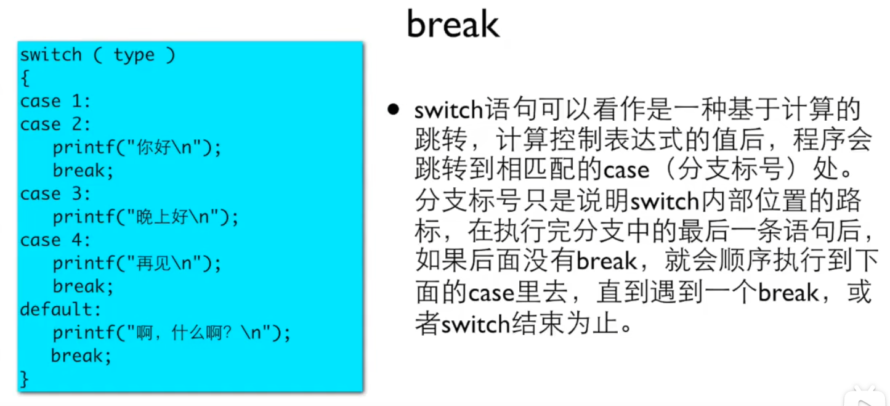
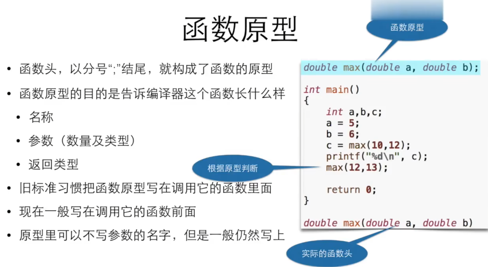

# 编译执行与解释执行


# 计算

出现在`scanf`格式字符串里面的内容，是必须输入的内容。

```c
scanf("prince%d %d",&a,&b);
输入时必须要有prince，并且a,b之间需要有空格
```

常量和变量


## 变量命名规则

在定义变量时，变量名可以是**字母、数字和下划线**的组合。但是也不是随便的组合，要注意以下几个命名规则：

1) 变量名的开头必须是字母或下划线，不能是数字。实际编程中最常用的是以字母开头，而以下划线开头的变量名是系统专用的。
2) 变量名中的字母是区分大小写的。比如 a 和 A 是不同的变量名，num 和 Num 也是不同的变量名。
3) 变量名绝对不可以是C语言关键字，这一点一定要记住！
4) 变量名中不能有空格。这个可以这样理解：因为上面我们说过，变量名是字母、数字、下划线的组合，没有空格这一项。


## 数据类型


## 表达式

```c
a(算子) =(运算符) b(算子) +(运算符) 5(算子);	//整个式子叫做表达式
```

### 运算符的优先级

所有关系运算符(>=,>,<,<=)的优先级比算数运算符低，(==.!=)比上述关系运算符优先级低，但是比赋值运算符高。


### 递增递减运算符


# 判断与循环

whie语句是一个循环语句，它会首先判断一个条件是否满足，如果条件满足，则执行后面紧跟着的语句或语句括号，然后再次判断条件是否满足，如果条件满足则再次执行，直到条件不满足为止。后面紧跟的语句或语句括号，就是循环体。
do-while循环和whie循环很像，唯一的区别是我们在循环体执行结束的时候才来判断条件。也就是说，无论如何，**循环都会执行至少一遍**，然后再来判断条件。与while循环相同的是，条件满足时执行循环，条件不满足时结束循环。


逻辑运算符的优先级 


逗号的运算优先级，自左向右运算。

嵌套情况下，未加大括号时，else总是和最近的if相匹配。

级联的if-else 

switch（type）语句中，type必须是int类型



可以在代码中加入`{}`，编译器不会报错


# 循环控制

break:跳出循环

continue:跳过循环这一轮剩下的语句进入下一轮


# 数组与函数

## 数组


数组可以看作时一种容器，其特点是：

1）其中所有的元素具有相同的数据类型；

2）一旦创建，不能改变大小

3） (数组中的元素在内存中是连续依次排列的）


将一个数组的值赋给另一个数组只能通过遍历赋值的方式。

数组作为函数的参数时：不能在`[]`中给出数组的大小; 不能再利用`sizeof`来计算数组的元素个数！


**对于大小可变的数组，需要先定义数组，然后再初始化。**

## 函数


函数没有参数也需要加上`()`





# 指针与字符串

## 指针

运算符`&`它的操作数必须是变量，获取变量的地址。**地址的大小是否与`int`相同取决于编译器**

堆栈分配内存是自顶向下的

**指针就是保存地址的变量**

`int *p`，是`*p`是`int`类型


函数参数传递表中的数组实际上是**指针**，将传入的`a[]`写作`*a`也不会报错。


`int b[]-->int *const b`


指针不可修改


通过指针不可修改


## 字符


逃逸字符

用来表达无法印出来的控制字符或特殊字符，它由一个反斜杠"\\"开头，后面跟上另一个字符，这两个字符合起来，组成了一个字符

```c
printf（"请分别输入身高的英尺和英寸，“如输入\"5 7\"表示5英尺7英寸："）
```


字符串变量的定义

```c
char *str = "Hello";
char word[]]="Hello";
char line[10] = "Hello";//字符串后面的\0也要算进长度里面
```

C语言的字符串是以字符数组的形态存在的，不能用运算符对字符串做运算，通过数组的方式可以遍历字符串，唯一特殊的地方是字符串字面量可以用来初始化字符数组。有标准库。


### char\*是字符串?

字符串可以表达为char\*的形式

char\*不一定是字符串

​	本意是指向字符的指针，可能指向的是字符的数组（就像int*一样)

​	只有它所指的字符数组有结尾的0，才能说它所指的是字符串


`scanf`读入一个单词）（到空格、tab或回车为止）

`scanf`是不安全的，因为不知道要读入的内容的长度


x86是小端字节序，低地址存放低位字节
如果函数内部存在与全局变量同名的变量，则全局变量被隐藏

gcc hello.c --save-temps 保存中间文件
编译过程：.c(源文件)->.i(编译预处理之后的文件)->.s(汇编代码文件)->.o(目标代码文件)->a.out(可执行文件)

```c
gcc -E filename.c -o filename.i	//这条命令的作用是生成预处理文件filename.i
gcc -S filename.c -o filename.s	//这条命令的作用是生成预编译文件filename.s
gcc -c filename.c -o filename.o	//这条命令的作用是生成汇编文件filename.o
```

tail 指令用于显示文件的末尾内容

定义内容不加分号，#开头的不是C语言代码，而是预处理指令

#include自己给的.h文件用""(在当前目录下找该文件);系统给的.h文件用<>

#include只是把文件内容拷贝到#include所在的位置
